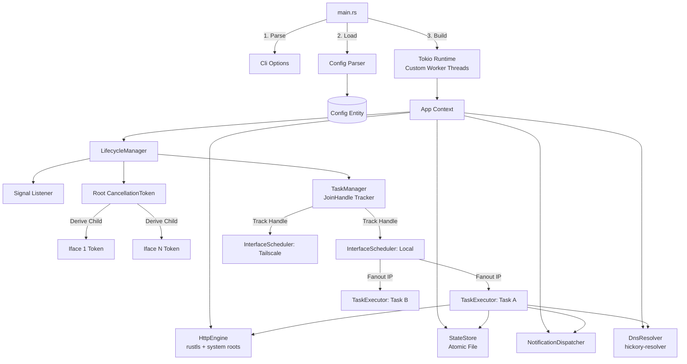
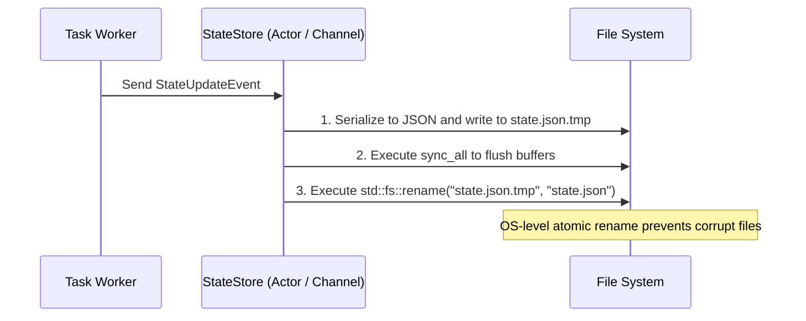
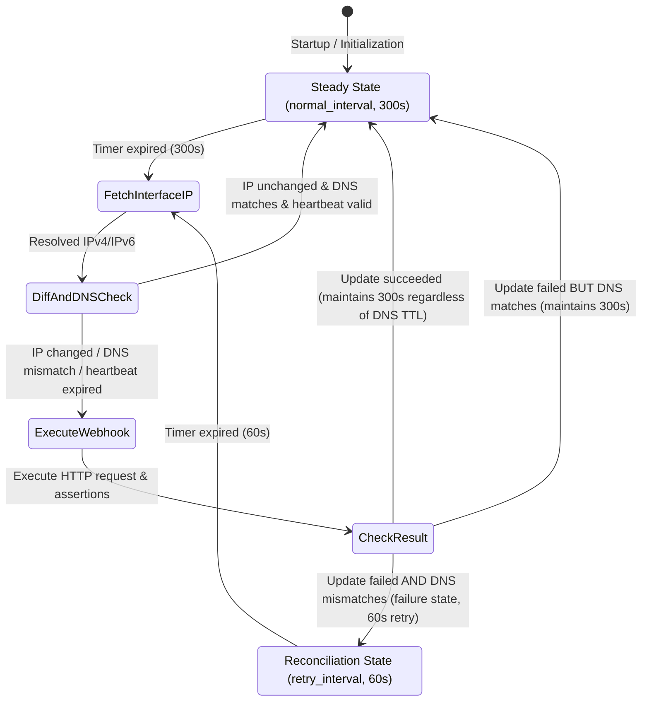

# RDNS System Design & Architecture Specification (Technical Design Specification)

This document defines the system architecture, module division, concurrency control, lifecycle management, and detailed engineering specifications for **RDNS** (a universal, lightweight, Webhook-driven Dynamic DNS client written in Rust).

---

## 1. System Overview & Design Philosophy

### 1.1 Design Goals

* **Universal Webhook-Driven**: Eliminates vendor-specific SDK hardcoding by abstracting all DNS operations into an expressive HTTP template request engine.
* **Rapid Startup/Shutdown & Graceful Drain**: Constructs a structured task lifecycle hierarchy, achieving sub-millisecond response for shutdown and task draining via asynchronous signals and cancellation tokens.
* **High Reliability & Lightweight Footprint**: Pure static compilation (`rustls` + platform-native root certificate store) with zero dynamic dependencies. Seamlessly scales from single-core embedded routers (single-threaded runtime) to multi-core servers.

### 1.2 Core Architectural Principles

1. **Struct-Centric & No Global State**:
   * Forbids `static mut`, global mutable singletons, or untracked standalone functions.
   * All capabilities converge into concrete struct instances, with dependencies injected via constructors (Dependency Injection) to enforce clear lifecycles and ownership.

2. **Full Handle Retention & Token Tree**:
   * Prohibits unmanaged `tokio::spawn` calls. Every spawned asynchronous task must retain its `JoinHandle` and register with a centralized task manager for tracking.
   * Constructs a hierarchical cancellation token tree using `tokio_util::sync::CancellationToken`:
     `Root Token` $\rightarrow$ `Task Token` $\rightarrow$ `Request/Sleep Token`.
   * When a cancellation signal is dispatched, tasks waiting on asynchronous suspension points (e.g., `sleep`, network I/O) terminate immediately.

3. **Zero-Lock / Light-Lock Concurrency (Share Nothing Architecture)**:
   * Follows the principle: "Do not communicate by sharing memory; instead, share memory by communicating." Each task scheduler maintains its own state machine, operating completely lock-free.
   * Configuration (`Config`) and the underlying HTTP client (`HttpClient`) are read-only once initialized, safely shared across threads via `Arc<T>` with zero lock overhead.
   * Persistence operations dispatch state mutations over asynchronous channels (`mpsc::channel`) to a single background writer Actor, eliminating cross-task disk contention.
   * In rare synchronization scenarios where locks are unavoidable, `parking_lot::RwLock` / `parking_lot::Mutex` must be used instead of standard library locks.

4. **DRY & "Parse, Don't Validate"**:
   * Operational requests and notification alerts share the same underlying HTTP engine and template renderer, preventing dual-track code duplication.
   * Configuration data validity is guaranteed upon deserialization. Business logic layers trust strongly typed structs, avoiding defensive null checks, duplicate sanitization, or redundant conversions across layers.

---

## 2. System Layering & Module Architecture

### 2.1 Source Module Structure

```text
src/
├── main.rs                 # Process entrypoint: CLI parsing, runtime builder, top-level error handling
├── cli.rs                  # CLI argument models and validation (Clap Derive)
├── config/                 # Configuration domain module
│   ├── mod.rs              # Unified Config export and parsing interface
│   ├── parser.rs           # YAML deserialization and environment variable expansion (${VAR})
│   ├── model.rs            # Strongly typed configuration entities (Global, Interface, Task, Request)
│   └── validator.rs        # Business rule validation (interface names, retry intervals, regex syntax)
├── provider/               # Predefined DDNS provider registry
│   └── mod.rs              # Built-in provider templates (dynu, dynv6, duckdns, he, noip) and CLI introspection
├── lifecycle/              # Lifecycle and shutdown coordination
│   ├── mod.rs              # Lifecycle orchestration service (LifecycleManager)
│   ├── signal.rs           # Cross-platform signal listeners (POSIX Unix Signals & Windows Console)
│   └── task_manager.rs     # Centralized JoinHandle tracking and drain timeout controller
├── ip/                     # IP resolution and DNS verification engine
│   ├── mod.rs              # InterfaceIpResolver dispatch interface and module exports
│   ├── dns.rs              # Remote DNS record verification via hickory-resolver
│   ├── remote.rs           # Remote HTTP prober with explicit protocol-stack binding
│   └── interface.rs        # Local interface IP reader (filters ULA, fe80::, RFC 4941; prioritizes SLAAC)
├── engine/                 # HTTP Webhook engine
│   ├── mod.rs              # HttpEngine facade
│   ├── client.rs           # Client builder with rustls-tls-native-roots and connection pools
│   ├── template.rs         # Safe {{ipv4}}, {{ipv6}}, {{domain}} placeholder substitution
│   ├── executor.rs         # Request construction and execution (supports Dry-Run preview interception)
│   └── verifier.rs         # Status code and regex/contains assertion verifier
├── scheduler/              # Task scheduler and state machine
│   ├── mod.rs              # SchedulerService cluster management
│   └── task.rs             # InterfaceScheduler probe loop and TaskExecutor (JoinSet concurrency, backoff)
├── persistence/            # State persistence
│   ├── mod.rs              # StateStore service (Channel Actor with debounced disk writes)
│   └── atomic_file.rs      # Atomic file persistence via temporary file rename
├── notification/           # Generic notification system
│   ├── mod.rs              # NotificationDispatcher
│   └── events.rs           # Change, failure, and recovery event models
└── error.rs                # Strongly typed domain errors (via thiserror)
```

### 2.2 Core Object Topology & Dependency Injection



---

## 3. Detailed Lifecycle & Graceful Shutdown Design

### 3.1 CancellationToken Tree Cascade Topology

```text
[Root CancellationToken] (Held by LifecycleManager)
   │
   ├── [Task 1 Token] (Child Token)
   │      │
   │      ├── [Sleep/Wait Token] ────────> Immediately aborts polling sleep
   │      └── [In-Flight Protection] ────> Marks active execution, protects current request
   │
   ├── [Task 2 Token] (Child Token)
   │      └── ...
   │
   └── [State Persistence Actor Token] ──> Flushes remaining mutations after tasks drain
```

1. **Fast-path Interrupt**:
   Most of a task's lifecycle is spent sleeping between update rounds (`interval`).
   Inside the execution loop, tasks listen to their child token using `tokio::select!`:

   ```rust
   tokio::select! {
       _ = child_token.cancelled() => {
           tracing::info!(task = %name, "Task received cancel signal, terminating loop immediately");
           break;
       }
       _ = tokio::time::sleep(interval) => {
           // Interval reached; perform update
       }
   }
   ```

   Once the Root Token is cancelled, sleep is interrupted instantaneously ($< 1\text{ms}$).

2. **In-Flight Drain Guard**:
   When a task is actively executing a network request, the external HTTP call and response assertion must run to completion to prevent inconsistent remote state.
   Tasks register an execution barrier before dispatch, and the shutdown procedure awaits active in-flight rounds.

### 3.2 Cross-Platform Signal Listener (`lifecycle/signal.rs`)

Normalizes low-level OS signal handling and supports POSIX `SIGHUP` configuration hot-reloading:

```rust
pub enum ProcessSignal {
    Shutdown(String),
    Reload,
}

pub struct SignalListener;

impl SignalListener {
    pub async fn wait_signal() -> Result<ProcessSignal, std::io::Error> {
        #[cfg(unix)]
        {
            use tokio::signal::unix::{signal, SignalKind};
            let mut sigint = signal(SignalKind::interrupt())?;
            let mut sigterm = signal(SignalKind::terminate())?;
            let mut sighup = signal(SignalKind::hangup())?;

            tokio::select! {
                _ = sigint.recv() => Ok(ProcessSignal::Shutdown("SIGINT".to_string())),
                _ = sigterm.recv() => Ok(ProcessSignal::Shutdown("SIGTERM".to_string())),
                _ = sighup.recv() => Ok(ProcessSignal::Reload),
            }
        }

        #[cfg(windows)]
        {
            use tokio::signal::windows::{ctrl_break, ctrl_c, ctrl_close, ctrl_logoff, ctrl_shutdown};
            let mut c_c = ctrl_c()?;
            let mut c_break = ctrl_break()?;
            let mut c_close = ctrl_close()?;
            let mut c_shutdown = ctrl_shutdown()?;
            let mut c_logoff = ctrl_logoff()?;

            tokio::select! {
                _ = c_c.recv() => Ok(ProcessSignal::Shutdown("CTRL_C".to_string())),
                _ = c_break.recv() => Ok(ProcessSignal::Shutdown("CTRL_BREAK".to_string())),
                _ = c_close.recv() => Ok(ProcessSignal::Shutdown("CTRL_CLOSE".to_string())),
                _ = c_shutdown.recv() => Ok(ProcessSignal::Shutdown("CTRL_SHUTDOWN".to_string())),
                _ = c_logoff.recv() => Ok(ProcessSignal::Shutdown("CTRL_LOGOFF".to_string())),
            }
        }
    }
}
```

### 3.3 JoinHandle Task Manager (`lifecycle/task_manager.rs`)

```rust
pub struct TaskManager {
    handles: parking_lot::Mutex<Vec<(String, tokio::task::JoinHandle<()>)>>,
}

impl TaskManager {
    pub fn new() -> Self {
        Self {
            handles: parking_lot::Mutex::new(Vec::new()),
        }
    }

    pub fn spawn_task<F>(&self, name: String, future: F)
    where
        F: std::future::Future<Output = ()> + Send + 'static,
    {
        let handle = tokio::spawn(future);
        self.handles.lock().push((name, handle));
    }

    pub async fn shutdown_all(&self, timeout_duration: std::time::Duration) {
        let mut handles = {
            let mut guard = self.handles.lock();
            std::mem::take(&mut *guard)
        };

        let drain_future = async {
            for (name, handle) in handles.iter_mut() {
                if let Err(e) = handle.await {
                    tracing::warn!(task = %name, error = %e, "Task join failed");
                }
            }
        };

        if tokio::time::timeout(timeout_duration, drain_future).await.is_err() {
            tracing::error!("Graceful shutdown timeout exceeded, aborting remaining tasks");
            for (name, handle) in handles {
                if !handle.is_finished() {
                    tracing::warn!(task = %name, "Aborting hung task");
                    handle.abort();
                }
            }
        }
    }
}
```

---

## 4. Concurrency Model & State Management

### 4.1 Zero-Lock Concurrency Architecture (Share Nothing Architecture)

1. **Interface Isolation & Task Fanout**:
   The system assigns an independent `InterfaceScheduler` to each defined `interface`. Each interface runs a dedicated background coroutine that independently probes its assigned IP addresses. The resolved IP is fanned out to bound `TaskExecutor` instances as read-only data. Schedulers maintain distinct `normal_interval` and `retry_interval` states without cross-interface blocking or duplicate network probes.

2. **Lock-Free Read-Only State**:
   Global configuration (`Config`), HTTP connection pools, and `DnsResolver` are wrapped in `Arc` and shared across the application. They remain strictly read-only throughout the process lifecycle with zero locking overhead.

### 4.2 State Persistence & Atomic Flush Protocol (`persistence/atomic_file.rs`)

To prevent corrupt or truncated persistence files during unexpected termination, logoffs, or power outages, `StateStore` implements atomic file writing:



* **Cross-Platform Compatibility**:
  `std::fs::rename` is inherently atomic on POSIX systems. On Windows, it maps to `MoveFileExW` with `MOVEFILE_REPLACE_EXISTING`. If the target file is temporarily locked, `atomic_file` provides retries with exponential backoff.

---

## 5. Core Subsystems Detailed Design

### 5.1 Configuration System & Environment Injection (`config/`)

* **Strongly Typed Deserialization**: Uses `serde_yaml` to deserialize configurations into typed Rust structures.
* **Environment Variable Expansion**: Recursively parses `${VARIABLE:-default}` expressions during YAML deserialization, keeping secrets out of configuration files.
* **Validation (Parse, Don't Validate)**:
  Centrally validates URL formats, positive intervals, non-empty interface names, and compiles regular expressions into cached `regex::Regex` instances during initialization.

### 5.2 IP Detection Engine (`ip/`)

#### Trait Definition

```rust
#[async_trait::async_trait]
pub trait IpFetcher: Send + Sync {
    async fn fetch_ipv4(&self) -> Result<std::net::Ipv4Addr, crate::error::IpFetchError>;
    async fn fetch_ipv6(&self) -> Result<std::net::Ipv6Addr, crate::error::IpFetchError>;
}
```

#### Detector Specifications

1. **Remote HTTP Probing (`remote.rs`)**:
   * Uses `reqwest::ClientBuilder::local_address` to enforce protocol stack binding:
     * Binds `0.0.0.0` when probing IPv4 to prevent dual-stack adapters from routing through IPv6.
     * Binds `::` when probing IPv6 to prevent fallback to IPv4.
   * Supports multiple fallback URLs, attempted sequentially until a valid IP is acquired.

2. **Local Interface Extraction & Address Sanitization (`interface.rs`)**:
   * Enumerates system network interfaces via `ifaddrsx::get_interfaces`, matching by regex pattern or adapter friendly names (supported on Windows).
   * **IPv6 Sanitization Pipeline**:
     1. Excludes Link-Local addresses (`fe80::/10`).
     2. Excludes Unique Local Addresses (ULA, `fc00::/7` and `fd00::/7`).
     3. Excludes Loopback (`::1`) and Multicast addresses.
     4. Excludes RFC 4941 temporary privacy addresses.
   * **RFC 4291 EUI-64 SLAAC Recognition (`prefer_slaac: true`)**:
     * ISPs frequently assign stateful DHCPv6 addresses (e.g., `::737`) alongside stateless SLAAC addresses (e.g., `::dabb:c1ff:fe67:6221`).
     * Following RFC 4291, MAC-derived EUI-64 SLAAC addresses have octets matching `octets[11] == 0xff && octets[12] == 0xfe`.
     * When `prefer_slaac: true` is enabled, the detector prioritizes this long-term stable address.
   * **IPv4 Private Address Protection**:
     * Automatically filters out RFC 1918 private addresses (`10.0.0.0/8`, `172.16.0.0/12`, `192.168.0.0/16`) and CGNAT addresses (`100.64.0.0/10`) by default.
     * Private addresses are preserved only when `allow_private: true` is explicitly configured.

### 5.3 Remote DNS Verification Engine (`ip/dns.rs`)

To prevent undetected record drift when cloud records are modified out-of-band, RDNS integrates `hickory-resolver` (v0.26.2 Tokio runtime):

1. **Resolver Construction**:
   * If `dns_server` is configured (e.g., `"8.8.8.8"` or `"1.1.1.1:53"`), parses target IP and port, builds `NameServerConfig::udp_and_tcp`, and instantiates an asynchronous resolver via `Resolver::builder_with_config`.
   * If unspecified, initializes `Resolver::builder_tokio()` to read native host DNS configurations (Windows Registry / Linux `resolv.conf`).
2. **Verification & Reconciliation**:
   * During task execution when the local IP is unchanged and a `domain` is configured, queries remote A / AAAA records.
   * If remote records differ from the local IP, flags an anomaly and triggers a corrective DDNS update.
   * Enforces a 60-second cooldown period after successful updates (`last_success_time < 60s`) to prevent redundant queries during DNS TTL propagation.

### 5.4 Custom Request Engine & TLS Specification (`engine/`)

#### 1. Client Caching & Per-Task Connection Pools (`engine/client.rs` & `engine/executor.rs`)

* Maintains a default `reqwest::Client` with connection pooling for general use.
* **Per-Task Connection Pools (`(Option<proxy>, tls_insecure)`)**:
  * `RequestExecutor` maintains a custom client pool using `parking_lot::RwLock<HashMap<(Option<String>, bool), reqwest::Client>>`.
  * Tasks configured with `tls_insecure: true` or dedicated proxies construct and cache separate clients.
  * Emits security warnings when `tls_insecure: true` is active:
    `tracing::warn!(task = %task_name, "Task configured with tls_insecure: true. TLS certificate verification is DISABLED.");`
* **TLS Security**:
  * Uses `rustls-tls-native-roots`, importing platform root certificates (Windows Certificate Store, macOS Keychain, Linux `/etc/ssl/certs`).

#### 2. Template Substitution & Custom Arguments (`engine/template.rs`)

* Accepts a structured context supporting built-in slots and custom parameters:

  ```rust
  pub struct TemplateContext<'a> {
      pub ipv4: Option<&'a str>,
      pub ipv6: Option<&'a str>,
      pub domain: Option<&'a str>,
      pub timestamp: Option<u64>,
      pub args: Option<&'a HashMap<String, String>>,
  }
  ```

* **Unified Substitution Pipeline**:
  * Built-in slots: `{{ipv4}}`, `{{ipv6}}`, `{{domain}}`, `{{timestamp}}`.
  * Custom named slots: Looked up from `ctx.args` (e.g., `{{password}}`, `{{token}}`, `{{zone_id}}`).
  * Environment variables in `args` (such as `${DYNU_PASSWORD:-default}`) are expanded during configuration loading.
* **Safe Replacement Validation**:
  If a referenced slot is missing from the context (e.g., `{{ipv4}}` referenced without IPv4 enabled, or missing `args`), returns `TemplateError::MissingSlot` and halts before sending malformed URLs.

#### 3. Bounded Streaming Response Reading & DoS Protection

* **DDNS Response Limit (1 MiB)**:
  `read_bounded_text` limits responses to `MAX_RESP_BODY_SIZE = 1024 * 1024` bytes using `resp.chunk().await`, short-circuiting on overflow with `RdnsError::Assertion` to prevent memory exhaustion (OOM).
* **Remote IP Probe Limit (4 KiB)**:
  `read_ip_text` limits remote IP probe responses to 4096 bytes.

#### 4. Dry-Run Mode & Unicode-Safe Masking (`engine/executor.rs`)

* When `--dry-run` is specified:
  * IP probing and template rendering execute normally.
  * The executor intercepts network dispatch, printing formatted previews to the console:
    * HTTP Method, URL, Body, assertion rules.
    * **Sensitive Header Masking**: Headers containing `authorization`, `token`, `secret`, `password`, `key`, or `auth` are masked.
    * **Unicode Boundary Protection (`mask_secret`)**: Uses `char_indices().nth(2)` to locate UTF-8 character boundaries, preventing panics on multi-byte characters (Chinese characters, Euro symbol `€`, emoji).
    * **Case-Insensitive Query Key Matching (`find_key_ci`)**: Matches sensitive query keys directly on byte slices without transforming the entire string to lowercase, preventing multi-byte offset shifts.
  * Returns simulated success without making live network writes.

### 5.5 Adaptive Dual-Speed Polling State Machine (`scheduler/`)

Balancing steady-state quota conservation with rapid failure recovery, RDNS implements an **adaptive dual-speed polling state machine**:

#### 1. Decision & Convergence Matrix

| Current Update State | Remote DNS Query Result | Next Sleep Duration | State Machine Behavior & Rationale |
| :--- | :--- | :--- | :--- |
| **No Update Needed** (IP unchanged & DNS matches) | Matches (`== actual_ip`) | `normal_interval` (300s) | Steady-state low-frequency polling |
| **Update Succeeded** | Mismatches (DNS TTL propagating) | `normal_interval` (300s) | **Critical protection**: Update sent; awaits TTL expiration without API storming |
| **Update Succeeded** | Matches (`== actual_ip`) | `normal_interval` (300s) | Steady-state operation |
| **Update Failed** | Matches (`== actual_ip`) | `normal_interval` (300s) | Remote DNS is already correct; maintains normal interval |
| **Update Failed** | **Mismatches** (`!= actual_ip` or unresolvable) | **`retry_interval` (60s)** | **Active failure state; shortens interval to 60s for rapid recovery** |

#### 2. State Machine Transition Diagram



#### 3. Execution Structures & Task Fanout (`scheduler/task.rs`)

* **`TaskRunOutcome`**: Single-task result carrying `should_shorten_interval: bool` and `error: Option<RdnsError>`.
* **`InterfaceRunOutcome`**: Aggregates `should_shorten_interval` across all tasks bound to an interface.
* **`InterfaceScheduler::run_loop`**: Dynamically determines `sleep(next_interval)` duration based on round outcomes.

### 5.6 Generic Notification System & Invariants (`notification/`)

* **DRY Implementation**: Notification calls reuse `engine::HttpEngine` for Webhook dispatch.
* **State Machine Invariants**:
  * **Recovery Before Change**: Successful updates dispatch `NotificationEvent::Recovery` first, clearing failure counters (`guard.remove(task_name).unwrap_or(0) > 0`) so recovery alerts fire exactly once.
  * **Actual Change Guard (`ip_actually_changed`)**: `NotificationEvent::Change` is dispatched only if the local IP genuinely changed. Periodic heartbeats (`force_update_interval`) that do not alter the IP suppress `Change` events.
  * **Saturating Counters**: Failure counters use `count.saturating_add(1)` to avoid integer overflow loops.
  * **Persistence Ordering**: State updates are committed to `StateStore` after notifications dispatch.

### 5.7 Predefined Provider Templates & CLI Introspection (`provider/`)

To simplify configuration for popular providers (Dynu, dynv6, DuckDNS, Hurricane Electric, No-IP), RDNS includes a zero-overhead provider registry:

#### 1. Provider Model (`provider/mod.rs`)

```rust
pub struct Provider {
    pub name: &'static str,
    pub aliases: &'static [&'static str],
    pub description: &'static str,
    pub website: &'static str,
    pub requires_domain: bool,
    pub required_args: &'static [&'static str],
    pub optional_args: &'static [&'static str],
    pub default_method: &'static str,
    pub default_url: &'static str,
    pub default_success_regex: Option<&'static str>,
    pub default_success_contains: &'static [&'static str],
    pub example_yaml: &'static str,
}
```

#### 2. Template Auto-Assembly & Validation

1. **Auto-Populating Templates**: In `validate_config(&mut Config)`, if a task specifies a `provider` without a `request`, the provider's default `RequestConfig` is cloned into `task.request`.
2. **User Overrides**: Explicit `request` fields take precedence over provider defaults, allowing custom headers or URL overrides.
3. **Mandatory Argument Validation**: Checks `p.requires_domain` and `p.required_args` (e.g., `args.password` for Dynu, `args.token` for dynv6), failing fast during startup if required parameters are missing.

#### 3. CLI Introspection Commands

* `rdns --list-providers`: Formats and lists all built-in providers, websites, templates, and parameters.
* `rdns --provider <NAME>` (alias `--show-provider <NAME>`): Displays detailed templates, parameter documentation, and copyable YAML examples.
* **Standalone Execution**: Provider commands run independently without requiring a local `config.yaml`.

---

## 6. Error Handling & Domain Model (`error.rs`)

Derives strongly typed, unambiguous domain errors via `thiserror`:

```rust
use thiserror::Error;

#[derive(Error, Debug)]
pub enum RdnsError {
    #[error("Configuration error: {0}")]
    Config(#[from] ConfigError),

    #[error("IP detection failed for task '{task}': {source}")]
    IpFetch {
        task: String,
        source: IpFetchError,
    },

    #[error("Template rendering error: missing slot for '{missing_key}'")]
    TemplateMissingKey { missing_key: String },

    #[error("HTTP request error: {0}")]
    Http(#[from] reqwest::Error),

    #[error("Response verification assertion failed: {reason}")]
    AssertionFailed { reason: String },

    #[error("Persistence I/O error: {0}")]
    Persistence(#[from] std::io::Error),

    #[error("Task was cancelled by shutdown token")]
    Cancelled,
}

#[derive(Error, Debug)]
pub enum ConfigError {
    #[error("Failed to read config file '{path}': {source}")]
    ReadFile {
        path: String,
        source: std::io::Error,
    },
    #[error("YAML parse error: {0}")]
    Yaml(#[from] serde_yaml::Error),
    #[error("Invalid configuration field '{field}': {message}")]
    Validation { field: String, message: String },
}

#[derive(Error, Debug)]
pub enum IpFetchError {
    #[error("All remote sources exhausted without success")]
    AllSourcesExhausted,
    #[error("Interface '{name}' not found on system")]
    InterfaceNotFound { name: String },
    #[error("No valid public IP found on interface '{name}'")]
    NoPublicIpFound { name: String },
    #[error("DNS query failed for domain '{domain}': {message}")]
    DnsLookup { domain: String, message: String },
    #[error("Network I/O error: {0}")]
    Io(#[from] std::io::Error),
}
```

---

## 7. Engineering & Coding Standards

### 7.1 Zero-Panic Policy

* `.unwrap()` and `.expect()` are **strictly forbidden** outside unit tests (`#[test]`).
* Array index and dictionary lookups must use safe accessor methods (`.get()`) with `ok_or_else` or `if let`.
* Asynchronous task errors must converge through `Result<T, E>` and log to `tracing::error!`.

### 7.2 Locks & Atomic Variables

* Standard library mutexes (`std::sync::Mutex`, `std::sync::RwLock`) are prohibited; use `parking_lot::Mutex` / `parking_lot::RwLock` when synchronization is needed.
* Avoid spinning on `AtomicBool` loops; use `tokio_util::sync::CancellationToken` or `tokio::sync::watch`.

### 7.3 Memory Efficiency & Zero-Copy Practices

* Template rendering writes directly into pre-allocated string buffers (`write!` with `reserve`).
* Static configuration strings are borrowed via `&str` slices, eliminating unnecessary `.clone()` allocations.

### 7.4 Module Encapsulation Lockdown

* Submodules in `mod.rs` must be declared privately (`mod executor;`, never `pub mod executor;`).
* Internal utilities and implementation details use `pub(crate)` or `pub(super)` visibility.
* Module entries export only essential public facade objects.
