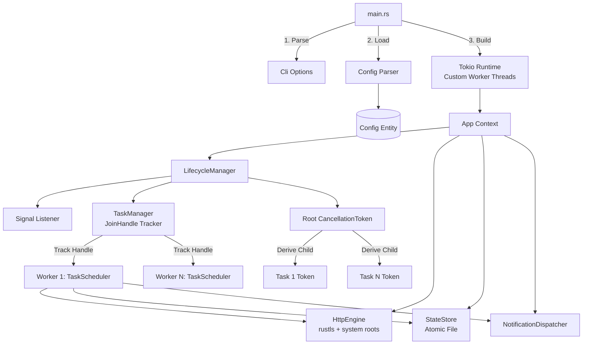
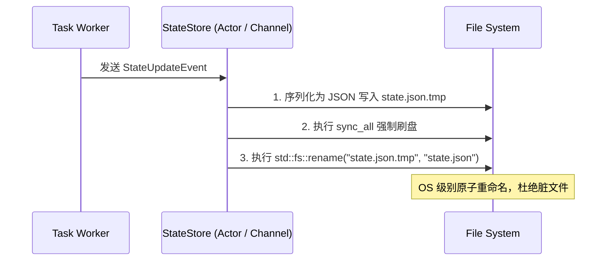
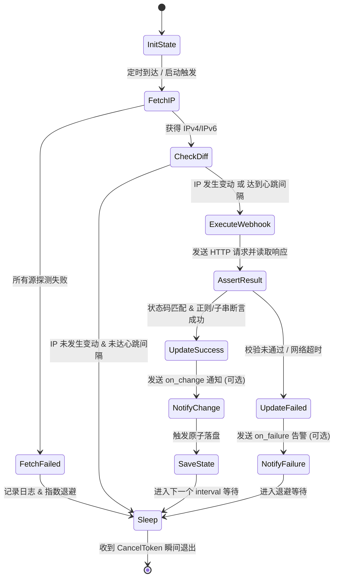

# RDNS 系统设计与架构规范 (Technical Design Specification)

本文档定义了 **RDNS**（基于 Rust 的通用轻量级 Webhook DDNS 客户端）的系统架构、模块划分、并发控制、生命周期管理以及详细设计规范。

---

## 一、 系统概述与设计哲学

### 1.1 设计目标
* **通用 Webhook 驱动**：不针对特定云厂商硬编码 SDK，将所有 DNS 操作抽象为 HTTP 模板请求引擎。
* **极速启停与优雅退避**：构建结构化的任务生命周期树，基于异步信号与取消令牌实现亚毫秒级响应停机与任务排空。
* **高可靠与轻量化**：跨平台纯静态编译交付（`rustls` + 操作系统原生证书库），零动态依赖；支持从单核路由器（单工作线程）到多核服务器无缝伸缩。

### 1.2 核心架构原则

1. **结构体驱动与零全局状态 (Struct-Centric & No Global State)**：
   * 严禁使用 `static mut`、全局可变单例或散落的孤立函数。
   * 所有功能均收敛为明确的结构体实例，通过构造函数注入依赖（Dependency Injection），明确生命周期与所有权。

2. **协程全生命周期托管与 CancellationToken 树 (Full Handle Retention & Token Tree)**：
   * 严禁无序裸跑 `tokio::spawn`。所有派生的异步任务均必须保留其 `JoinHandle` 并纳入任务管理器集中追踪。
   * 基于 `tokio_util::sync::CancellationToken` 构建层级化的 Token 树：
     `Root Token` $\rightarrow$ `Task Token` $\rightarrow$ `Request/Sleep Token`。
   * 取消信号下发时，各任务在异步等待点（如 `sleep`、网络 IO）立即响应退出，实现最快时效的安全终止。

3. **零锁/轻量锁并发哲学 (Zero-Lock / Parkinglot Fallback)**：
   * 遵循“通过通信共享内存，而非通过内存共享通信”。每个任务调度器独占自身的状态机，调度过程完全无锁。
   * 配置（`Config`）与底层 HTTP 客户端（`HttpClient`）初始化后为只读（Read-Only），通过 `Arc<T>` 安全跨线程共享，无需任何锁。
   * 持久化状态同步采用内部消息通道（`mpsc` Channel）汇聚到单一的落盘服务（Actor 模式），消除跨任务竞争。
   * 在必须使用互斥锁的极少数内部数据同步场景，强制使用 `parking_lot::RwLock` / `parking_lot::Mutex`，严禁使用重量级 `std::sync` 锁。

4. **无重复与无无效防御 (DRY & Parse, Don't Validate)**：
   * 业务请求与告警通知全面复用底层 HTTP 请求引擎与模板渲染器，严禁双轨制重复实现。
   * 配置反序列化完成后即保证数据合法性，业务逻辑层信赖强类型结构体，杜绝在每一层调用重复进行防御性判空、重复清洗与无效转换。

---

## 二、 系统分层与模块架构

### 2.1 源码模块结构

```text
src/
├── main.rs                 # 进程入口：CLI 解析、运行时构建、顶级错误捕获
├── cli.rs                  # 命令行参数模型与校验 (Clap Derive)
├── config/                 # 配置领域模块
│   ├── mod.rs              # 统一导出 Config 结构体与解析接口
│   ├── parser.rs           # YAML 反序列化、环境变量展开 (${VAR})
│   ├── model.rs            # 强类型配置实体定义
│   └── validator.rs        # 业务级规则校验 (网卡名、正则表达式等)
├── lifecycle/              # 生命周期与停机管理
│   ├── mod.rs              # 生命周期编排服务 (LifecycleManager)
│   ├── signal.rs           # 跨平台信号监听器 (POSIX Unix Signal & Windows Console)
│   └── task_manager.rs     # JoinHandle 集中追踪与排空超时控制器
├── ip/                     # IP 探测引擎
│   ├── mod.rs              # IpFetcher Trait 抽象与工厂
│   ├── remote.rs           # 基于协议栈强制绑定的远程 HTTP 探测器
│   └── interface.rs        # 网卡直读与智能净化器 (过滤 ULA、fe80::、临时扩展)
├── engine/                 # HTTP Webhook 驱动引擎
│   ├── mod.rs              # HttpEngine 外观服务
│   ├── client.rs           # 基于 rustls-tls-native-roots 的 Client 构造与连接池
│   ├── template.rs         # {{ipv4}}, {{ipv6}}, {{domain}} 占位符流式替换
│   ├── executor.rs         # 请求构造与执行 (支持 Dry-Run 模式拦截)
│   └── verifier.rs         # 响应状态码与正则/包含断言校验
├── scheduler/              # 任务调度与状态机
│   ├── mod.rs              # 调度集群入口 (SchedulerService)
│   ├── task.rs             # 单任务调度循环 (结合 CancellationToken)
│   └── state.rs            # 任务执行状态、比对与心跳检测
├── persistence/            # 状态持久化
│   ├── mod.rs              # StateStore 服务
│   └── atomic_file.rs      # 基于临时文件与系统 Rename 的原子落盘保证
├── notification/           # 通用通知系统
│   ├── mod.rs              # NotificationDispatcher 通知分发器
│   └── events.rs           # 变更、失败、恢复事件模型
└── error.rs                # 领域强类型错误定义 (基于 thiserror)
```

### 2.2 核心对象拓扑与依赖注入



---

## 三、 生命周期与优雅停机详细设计

### 3.1 CancellationToken 树级联拓扑

```text
[Root CancellationToken] (由 LifecycleManager 持有)
   │
   ├── [Task 1 Token] (Child Token)
   │      │
   │      ├── [Sleep/Wait Token] ────────> 快速终止轮询等待
   │      └── [In-Flight Protection] ────> 标记执行中状态，保护单次请求
   │
   ├── [Task 2 Token] (Child Token)
   │      └── ...
   │
   └── [State Persistence Actor Token] ──> 等待各任务排空后执行最终落盘
```

1. **响应最快退出机制 (Fast-path Interrupt)**：
   任务生命周期中主要时间消耗在两次更新之间的定时休眠（`interval`）。
   每个任务在循环中通过 `tokio::select!` 监听自身子 Token：
   ```rust
   tokio::select! {
       _ = child_token.cancelled() => {
           tracing::info!(task = %name, "Task received cancel signal, terminating loop immediately");
           break;
       }
       _ = tokio::time::sleep(interval) => {
           // 定时到达，执行更新操作
       }
   }
   ```
   只要 Root Token 被取消，休眠瞬间中断，耗时 $< 1\text{ms}$。

2. **进行中请求保护 (In-Flight Drain Guard)**：
   当任务正在发起网络请求时，必须保证外部 HTTP 请求与断言执行完整，防止破坏服务商侧状态。
   任务在进入执行阶段前记录执行屏障，主停机流程等待所有注册的当前轮次执行完成。

### 3.2 跨平台信号监听实现抽象 (`lifecycle/signal.rs`)

统一屏蔽不同操作系统信号处理的底层差异：

```rust
pub struct SignalListener;

impl SignalListener {
    pub async fn wait_shutdown_signal() -> Result<String, std::io::Error> {
        #[cfg(unix)]
        {
            use tokio::signal::unix::{signal, SignalKind};
            let mut sigint = signal(SignalKind::interrupt())?;
            let mut sigterm = signal(SignalKind::terminate())?;

            tokio::select! {
                _ = sigint.recv() => Ok("SIGINT".to_string()),
                _ = sigterm.recv() => Ok("SIGTERM".to_string()),
            }
        }

        #[cfg(windows)]
        {
            use tokio::signal::windows::{ctrl_break, ctrl_c, ctrl_close, ctrl_logoff, ctrl_shutdown};
            let mut c_c = ctrl_c()?;
            let mut c_break = ctrl_break()?;
            let mut c_close = ctrl_close()?;
            let mut c_shutdown = ctrl_shutdown()?;
            let mut c_logoff = ctrl_logoff()?;

            tokio::select! {
                _ = c_c.recv() => Ok("CTRL_C".to_string()),
                _ = c_break.recv() => Ok("CTRL_BREAK".to_string()),
                _ = c_close.recv() => Ok("CTRL_CLOSE".to_string()),
                _ = c_shutdown.recv() => Ok("CTRL_SHUTDOWN".to_string()),
                _ = c_logoff.recv() => Ok("CTRL_LOGOFF".to_string()),
            }
        }
    }
}
```

### 3.3 JoinHandle 任务管理器 (`lifecycle/task_manager.rs`)

```rust
pub struct TaskManager {
    handles: parking_lot::Mutex<Vec<(String, tokio::task::JoinHandle<()>)>>,
}

impl TaskManager {
    pub fn new() -> Self {
        Self {
            handles: parking_lot::Mutex::new(Vec::new()),
        }
    }

    pub fn spawn_task<F>(&self, name: String, future: F)
    where
        F: std::future::Future<Output = ()> + Send + 'static,
    {
        let handle = tokio::spawn(future);
        self.handles.lock().push((name, handle));
    }

    pub async fn shutdown_all(&self, timeout_duration: std::time::Duration) {
        let mut handles = {
            let mut guard = self.handles.lock();
            std::mem::take(&mut *guard)
        };

        let drain_future = async {
            for (name, handle) in handles.iter_mut() {
                if let Err(e) = handle.await {
                    tracing::warn!(task = %name, error = %e, "Task join failed");
                }
            }
        };

        if tokio::time::timeout(timeout_duration, drain_future).await.is_err() {
            tracing::error!("Graceful shutdown timeout exceeded, aborting remaining tasks");
            for (name, handle) in handles {
                if !handle.is_finished() {
                    tracing::warn!(task = %name, "Aborting hung task");
                    handle.abort();
                }
            }
        }
    }
}
```

---

## 四、 并发模型与状态管理

### 4.1 零锁并发设计原则 (Share Nothing Architecture)

1. **调度器完全独立**：
   每个 `TaskScheduler` 独立实例化，并持有属于该任务的只读配置副本（`Arc<TaskConfig>`）、只读 `Arc<HttpEngine>`、以及该任务唯一的 `child_token`。
   任务的状态（`current_ipv4`, `current_ipv6`, `last_success_time`）属于该协程栈内部私有变量，无需并发竞争。

2. **只读数据无锁化**：
   全局配置结构体 `Config` 与底层 HTTP 连接池通过 `Arc` 进行共享，全系统生命周期为只读，零锁开销。

### 4.2 状态持久化与原子落盘协议 (`persistence/atomic_file.rs`)

为了防止系统在关机、注销或停电瞬间产生半写损坏的持久化文件，`StateStore` 实现原子文件写入机制：



* **Windows / Linux / macOS 统一兼容**：
  Rust 标准库的 `std::fs::rename` 在 POSIX 系统上天然原子；在 Windows 上，底层对应 `MoveFileExW`（使用 `MOVEFILE_REPLACE_EXISTING` 标识覆盖旧文件）。若目标文件被独占，`atomic_file` 提供重试与退避保障。

---

## 五、 核心子系统详细设计

### 5.1 配置系统与环境变量注入 (`config/`)

#### 设计规则
* **强类型解析**：使用 `serde_yaml` 将 YAML 转换为强类型结构体。
* **环境变量展开**：反序列化前或反序列化字符串字段时，通过轻量解析器将 `${VARIABLE:-default}` 动态替换为系统环境变量，防止凭据泄露。
* **严格校验 (Parse, Don't Validate)**：
  配置加载时集中校验：URL 格式合法性、`interval > 0`、网卡名称非空、正则表达式可被正确编译（编译结果缓存为 `regex::Regex`，后续无需重复编译）。

### 5.2 IP 探测引擎 (`ip/`)

#### Trait 抽象定义
```rust
#[async_trait::async_trait]
pub trait IpFetcher: Send + Sync {
    async fn fetch_ipv4(&self) -> Result<std::net::Ipv4Addr, crate::error::IpFetchError>;
    async fn fetch_ipv6(&self) -> Result<std::net::Ipv6Addr, crate::error::IpFetchError>;
}
```

#### 探测器实现规范
1. **Remote HTTP 探测 (`remote.rs`)**：
   * 必须通过 `reqwest::ClientBuilder::local_address` 分离协议栈：
     * 查询 IPv4 时强制绑定 `0.0.0.0`，杜绝系统双栈网卡走 v6 访问接口。
     * 查询 IPv6 时强制绑定 `::`，杜绝降级到 v4。
   * 支持多 URL 备选，按配置顺序依次回退，直到获得有效 IP 或耗尽重试。

2. **本地网卡直读与智能净化 (`interface.rs`)**：
   * 遍历系统网络接口（`get_if_addrs`），按用户正则匹配接口名称（如 `eth0`、`enp.*`）。
   * **IPv6 净化流水线**：
     1. 排除链路本地地址（`fe80::/10`）。
     2. 排除内网唯一本地地址 ULA（`fc00::/7` 与 `fd00::/7`）。
     3. 排除回环（`::1`）与多播地址。
     4. 排除 RFC 4941 临时隐私地址（根据系统网卡标志位 `is_temporary` / 范围或前缀规则），优先匹配稳定分配的 Global Unicast SLAAC/DHCPv6 地址。
   * **IPv4 智能防护**：
     * 默认自动过滤 RFC 1918 私网地址（`10.0.0.0/8`, `172.16.0.0/12`, `192.168.0.0/16`）与 CGNAT 地址（`100.64.0.0/10`）。
     * 当任务配置 `allow_private: true` 时才允许保留私网 IP。

### 5.3 自定义请求引擎与 TLS 规范 (`engine/`)

#### 1. 客户端单例与连接池 (`engine/client.rs`)
* 整个进程维护唯一的底层 `reqwest::Client` 实例，内建连接池，避免频繁进行 TCP/TLS 握手。
* **TLS 规范**：
  * 使用 `rustls-tls-native-roots`。在初始化构建 Client 时，自动调用系统证书装载接口（加载 Windows 根证书存储库、macOS Keychain、Linux 系统 CA 目录）。
  * 若配置了 `tls_insecure: true`，设置 `.danger_accept_invalid_certs(true)`。
  * 若配置了 `proxy`，统一装载为 `reqwest::Proxy`。

#### 2. 安全模板变量替换 (`engine/template.rs`)
* 模板渲染接收结构体上下文：
  ```rust
  pub struct TemplateContext<'a> {
      pub ipv4: Option<&'a str>,
      pub ipv6: Option<&'a str>,
      pub domain: Option<&'a str>,
      pub timestamp: u64,
  }
  ```
* **安全替换断言**：
  在执行替换前，扫描模板中的占位符。若模板中含有 `{{ipv4}}` 但上下文中 `ipv4 == None`（例如未获取到 IPv4），**立即中断并返回强类型错误**，严禁将包含明文 `{{ipv4}}` 的错误 URL 发往服务商。

#### 3. 演练模式拦截 (`engine/executor.rs`)
* 当 CLI 传入 `--dry-run` 时：
  * 依然完整执行 IP 探测与模板渲染；
  * `Executor` 拦截实际的网络发送逻辑，在控制台通过结构化格式输出即将发送的 HTTP 请求：
    * Method、URL
    * Headers（自动对 `Authorization`、`Token`、`Password` 等敏感键执行脱敏掩码，如 `Bearer secr****`）
    * Body
    * 断言规则预览
  * 直接模拟返回虚拟成功结果，便于调试。

### 5.4 调度器与任务状态机 (`scheduler/`)

每个任务的独立轮询循环严格遵循以下状态机流转：



### 5.5 通用通知系统 (`notification/`)

* **DRY 原则彻底贯彻**：
  通知服务直接复用 `engine::HttpEngine` 执行外部 Webhook 调用。
* **告警抑制器 (Alert Suppressor)**：
  在内存中维护任务连续失败计数器。仅在状态由“正常”进入“首次失败”时触发 `on_failure`；后续连续失败时根据配置实施静默，直到任务成功后触发一次 `on_recovery`，杜绝故障期间报警刷屏。

---

## 六、 错误处理与领域模型 (`error.rs`)

统一基于 `thiserror` 派生强类型、无歧义的错误体系，严格禁止使用通用的字符串错误。

```rust
use thiserror::Error;

#[derive(Error, Debug)]
pub enum RdnsError {
    #[error("Configuration error: {0}")]
    Config(#[from] ConfigError),

    #[error("IP detection failed for task '{task}': {source}")]
    IpFetch {
        task: String,
        source: IpFetchError,
    },

    #[error("Template rendering error: missing slot for '{missing_key}'")]
    TemplateMissingKey { missing_key: String },

    #[error("HTTP request error: {0}")]
    Http(#[from] reqwest::Error),

    #[error("Response verification assertion failed: {reason}")]
    AssertionFailed { reason: String },

    #[error("Persistence I/O error: {0}")]
    Persistence(#[from] std::io::Error),

    #[error("Task was cancelled by shutdown token")]
    Cancelled,
}

#[derive(Error, Debug)]
pub enum ConfigError {
    #[error("Failed to read config file '{path}': {source}")]
    ReadFile {
        path: String,
        source: std::io::Error,
    },
    #[error("YAML parse error: {0}")]
    Yaml(#[from] serde_yaml::Error),
    #[error("Invalid configuration field '{field}': {message}")]
    Validation { field: String, message: String },
}

#[derive(Error, Debug)]
pub enum IpFetchError {
    #[error("All remote sources exhausted without success")]
    AllSourcesExhausted,
    #[error("Interface '{name}' not found on system")]
    InterfaceNotFound { name: String },
    #[error("No valid public IP found on interface '{name}'")]
    NoPublicIpFound { name: String },
    #[error("Network I/O error: {0}")]
    Io(#[from] std::io::Error),
}
```

---

## 七、 编码与工程规范指南

### 7.1 Panic 零容忍准则
* 除单元测试（`#[test]`）外，代码中**严禁出现 `.unwrap()` 与 `.expect()`**。
* 数组访问、字典查询必须使用安全切片操作（如 `.get()`）结合 `ok_or_else` 或 `if let`。
* 异步任务中的错误一律通过 `Result<T, E>` 逐级向上收敛并记录到 `tracing::error!`。

### 7.2 锁与原子变量规范
* 严禁引入 `std::sync::Mutex` 或 `std::sync::RwLock`，若需使用同步锁必须使用 `parking_lot::Mutex` / `parking_lot::RwLock`。
* 不使用手写循环的 `AtomicBool` 做自旋等待；一律使用 `tokio_util::sync::CancellationToken` 或 `tokio::sync::watch`。

### 7.3 内存效率与零拷贝建议
* 模板渲染引擎使用流式写入（`write!` into `String` 缓冲区），预估容量（`reserve`），避免中间产生多次无谓的临时 `String` 分配。
* 配置反序列化后的静态字符串全面使用引用（`&str`）切片借用，消除多余的 `.clone()`。

### 7.4 模块可见性防护 (Encapsulation Lockdown)
* 所有子模块在 `mod.rs` 中一律私有声明（`mod executor;`，严禁 `pub mod executor;`）。
* 内部工具函数、私有结构体限定可见性为 `pub(crate)` 或 `pub(super)`。
* 各模块的 `mod.rs` 只向外重新导出调用方真正需要的高层外观对象。
